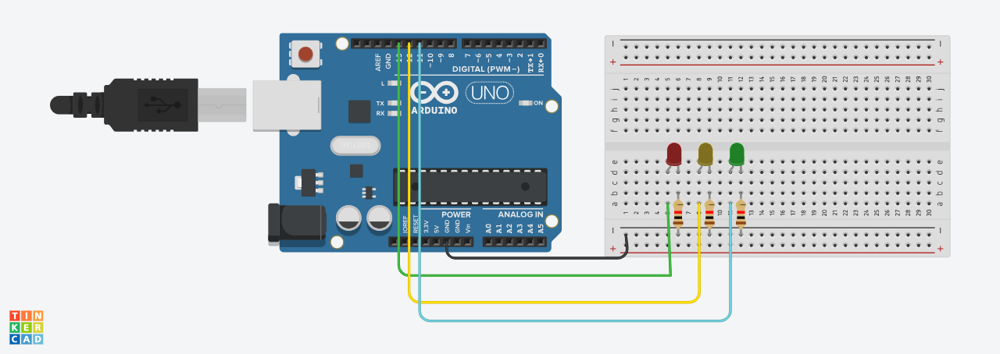

# Semáforo

## 1. Protótipo virtual

## 1.1 Construção do protótipo virtual

Como primeiro passo para construção do protótipo, foi realizada uma simulação virtual no Tinkercad para melhor direcionamento e entendimento do projeto.



### 1.2 Desenvolvimento do código

Para que o temporizador fosse construído da maneira correta, de acordo com o enunciado da ponderada no qual é pedido para que as luzes sigam a lógica: 
- 6 segundos no vermelho
- 4 segundos no verde
- 2 segundos no amarelo

Foi desenvolvido o seguinte código:

``` C++
void setup()
{
  pinMode(13, OUTPUT);
  pinMode(12, OUTPUT);
  pinMode(11, OUTPUT);
}

void loop()
{
  // Vermelho
  digitalWrite(13, HIGH);
  delay(6000); 
  digitalWrite(13, LOW);

  // Verde
  digitalWrite(11, HIGH);
  delay(4000); 
  digitalWrite(11, LOW);

  // Amarelo
  digitalWrite(12, HIGH);
  delay(2000); 
  digitalWrite(12, LOW);
}
``` 

Posteriormente transformado para POO e adicionando ponteiro:

``` C++
class Semaforo {
  private:
    int pinoVermelho;
    int pinoAmarelo;
    int pinoVerde;

  public:
    // Construtor
    Semaforo(int vermelho, int amarelo, int verde) {
      pinoVermelho = vermelho;
      pinoAmarelo = amarelo;
      pinoVerde = verde;

      pinMode(pinoVermelho, OUTPUT);
      pinMode(pinoAmarelo, OUTPUT);
      pinMode(pinoVerde, OUTPUT);
    }

    void vermelho(int tempo) {
      digitalWrite(pinoVermelho, HIGH);
      delay(tempo);
      digitalWrite(pinoVermelho, LOW);
    }

    void amarelo(int tempo) {
      digitalWrite(pinoAmarelo, HIGH);
      delay(tempo);
      digitalWrite(pinoAmarelo, LOW);
    }

    void verde(int tempo) {
      digitalWrite(pinoVerde, HIGH);
      delay(tempo);
      digitalWrite(pinoVerde, LOW);
    }

    void cicloCompleto() {
      vermelho(6000);
      verde(4000);
      amarelo(2000);
    }
};

// Ponteiro para o objeto Semaforo
Semaforo *semaforo;

void setup() {
  // Instancia o objeto dinamicamente
  semaforo = new Semaforo(13, 12, 11);
}

void loop() {
  semaforo->cicloCompleto();
}
``` 

## 2. Construção do protótipo físico

### 2.1 Materiasi utilizados

Para realizar a montagem física do protótipo, foi utilizado os seguintes materiais:

- LED - 3x
- Jumper Macho-Macho - 3x
- Jumper Macho-Fêmea - 6x
- Protoboard - 1x
- Arduino - 1x
- Resistor - 3x
- Base para os LED's - 1x

### 2.2 Montagem física

Para realizar a montagem física faça o seguinte:

Conecte Jumpers Macho-Macho:
- Um do GND à coluna positiva
- Três respectivamente da porta 13 à a9, 12 à a15 e 11 à a21

Conecte resistores:
- Três resistores da coluna positiva aos quadrados a10, a16 e a22

Conecte Jumpers Macho-Fêmea:
- Dois jumpers Macho-Fêmea que vão dos quadrados e9 e e10 até o LED vermelho
- Dois jumpers Macho-Fêmea que vão dos quadrados e15 e e16 até o LED amarelo
- Dois jumpers Macho-Fêmea que vão dos quadrados e21 e e22 até o LED verde


## 3. Link
 
Para acessar o link de demonstração, entre no [drive](https://drive.google.com/file/d/1ZOd04UKnVC6TI5uyo8jtfpJQYDKvoOwn/view?usp=drive_link).

